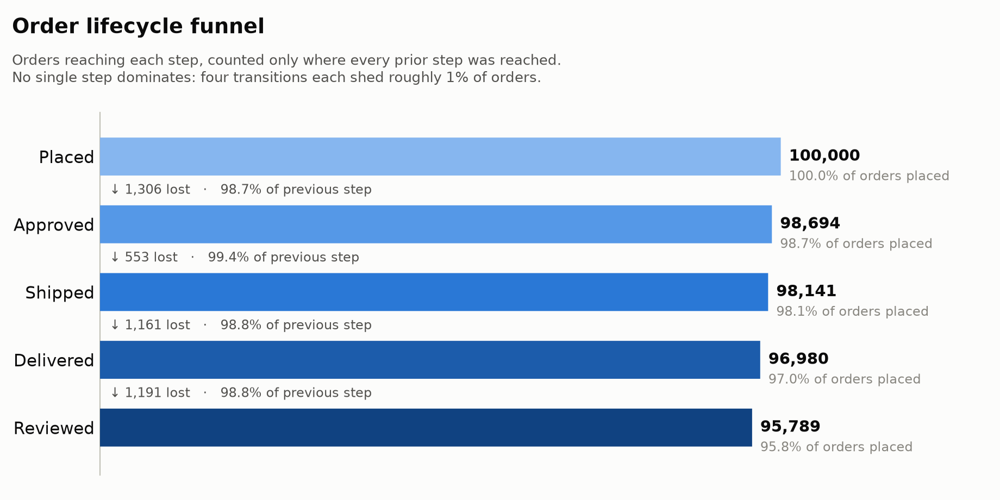
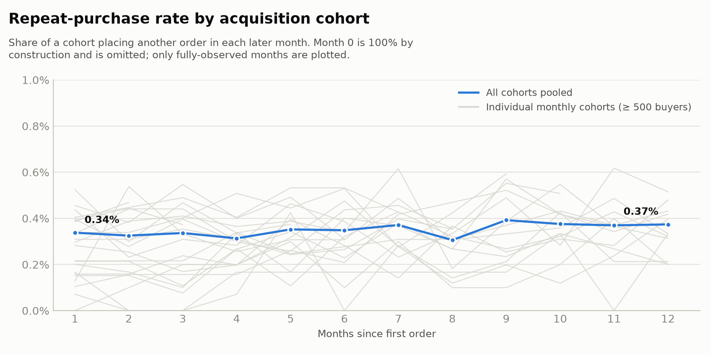
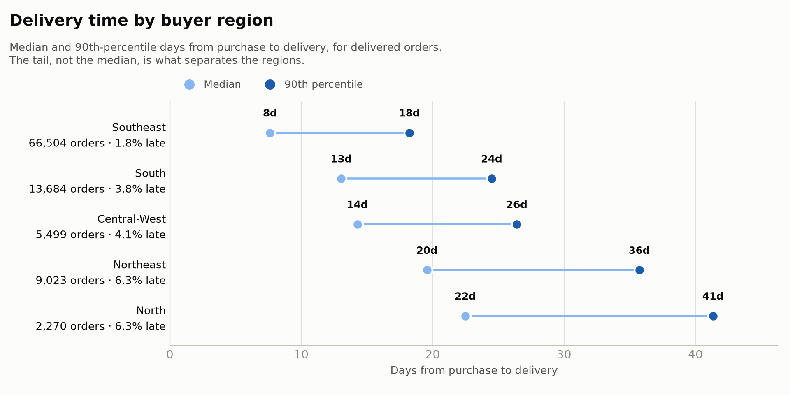

# Analysis

Three questions, three charts, one paragraph each. Every number here comes from a
query in [`scripts/build_charts.py`](scripts/build_charts.py) run against the
built marts — nothing is transcribed by hand, so regenerating after a model
change either reproduces these figures or visibly contradicts the prose.

Scope: 100,000 orders from 96,800 buyers between 2016-09-06 and 2018-10-17,
R$19.2M of gross merchandise value, collapsed into 691,505 events.

> The figures are rendered from the schema-identical generated dataset described
> in the [README](README.md#getting-the-data). Point `raw_data_dir` at the real
> Kaggle download and `make build && make charts` reproduces the same three
> charts on the real numbers — the queries do not change.

---

## 1. Funnel drop-off

The marketplace loses about 4% of orders across the whole lifecycle, and — the
useful finding — it loses them evenly. There is no single broken step to go fix:
approval sheds 1,306 orders, delivery 1,161, review 1,191, and shipping only 553.
An operations team hoping this chart would point at one queue will be
disappointed, and that is worth knowing before a quarter is spent on it. Payment
method barely moves approval either (98.5% for voucher through 98.9% for debit
card), which rules out the usual first suspect. The interesting number is the one
that is *not* in the funnel: 2,416 orders fired `review_submitted` without ever
reaching `delivered` — the marketplace surveys cancelled and stuck orders too.
Counting raw event hits, more orders "reach" review than reach delivery, and the
funnel is not monotonic at all. That is why `fct_funnel_steps` carries two
columns, `is_reached` and `is_reached_in_sequence`, and why the chart uses the
second. Those 2,416 buyers average 1.9 stars against 4.27 for an on-time
delivery, so they are not a rounding error to be filtered away; they are the
angriest population in the dataset, and modelling the funnel the naive way hides
them twice — once by inflating the last bar, and once by never naming them.

## 2. Retention curves

Retention is, essentially, nil. Pooled across cohorts, 0.34% of a cohort places
another order in month 1, and the curve does not decay so much as sit flat near
0.35% for a year — 0.37% at month 12, statistically indistinguishable from where
it started. Only 3.25% of buyers ever place a second order. A retention curve is
normally read for its shape (how fast does it decay, where does it flatten); this
one has no shape to read, and the honest conclusion is that this is a
transactional marketplace with no repeat behaviour to retain, not a subscription
business having a bad quarter. Two modelling decisions had to be right for the
chart to say even that much. First, cohorts are keyed on `customer_unique_id`,
not `customer_id`: the raw file mints a fresh `customer_id` per checkout, so
keying on it would report 0.00% forever and the flatness would be an artefact
rather than a finding. Second, `agg_cohort_retention` materialises the full
cohort × month grid including the zeros, and flags `is_fully_observed` — a
sparse table would let a chart interpolate over months with no returning buyers,
and every cohort's final month is partial and would draw a fake cliff. The chart
plots only fully-observed months for exactly that reason.

## 3. Delivery time by region

Geography is the strongest signal in the dataset, and it lives in the tail rather
than the median. A Southeast buyer waits 8 days at the median; a North buyer
waits 22. But the 90th percentiles are 18 days against 41 — the gap widens from
14 days to 23 as you move into the tail, so the North's problem is not that
delivery is uniformly slower, it is that the bad cases are far worse. Late
deliveries against the promise made at checkout track the same ordering: 1.8% in
the Southeast, 6.3% in the North and Northeast. The cause is structural rather
than regional incompetence: sellers are overwhelmingly concentrated in the
Southeast, so `shipping_lane` explains it better than buyer region alone —
intra-state orders arrive in 5.7 days at the median and are late 0.8% of the
time, inter-region orders take 13.4 days and are late 4.0%. That has a direct
revenue consequence through the review scores: on-time deliveries average 4.27
stars, late ones 2.61. The lever is not "make the carriers faster", it is seller
distribution — every seller onboarded outside the Southeast converts a
inter-region lane into an intra-state one for the buyers nearest to them.

---

Three charts, and no fourth. Adding a category-mix or a payment-method breakdown
would be easy and would not answer a question anyone asked.
